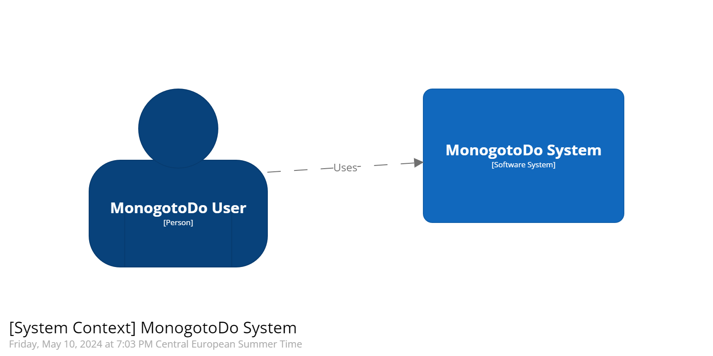
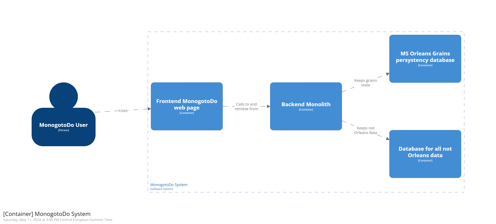

System Context Diagram
----------------------

- *This diagram describes MonogotoDo system context.*

<h1 align="center">
  
</h1>


- *This diagram describes MonogotoDo container context.*

<h1 align="center">
  
</h1>

Here is code for it written in [scructurzr](https://structurizr.com):

```
workspace {

    model {
        user = person "MonogotoDo User"
        softwareSystem = softwareSystem "MonogotoDo System" {
            frontend = container "Frontend MonogotoDo web page" {
                user -> this "Uses"
            }
            backend = container "Backend Monolith" {
                frontend -> this "Calls to and retrieve from"
            }
            orleansPersystency = container "MS Orleans Grains persystency database" {
                backend -> this "Keeps grains state"
            }
            backendDatabase = container "Database for all not Orleans data" {
                backend -> this "Keeps not Orleans data"
            }
        }
    }

    views {
        systemContext softwareSystem {
            include *
            autolayout lr
        }

        container softwareSystem {
            include *
            autolayout lr
        }

        theme default
    }

}
```